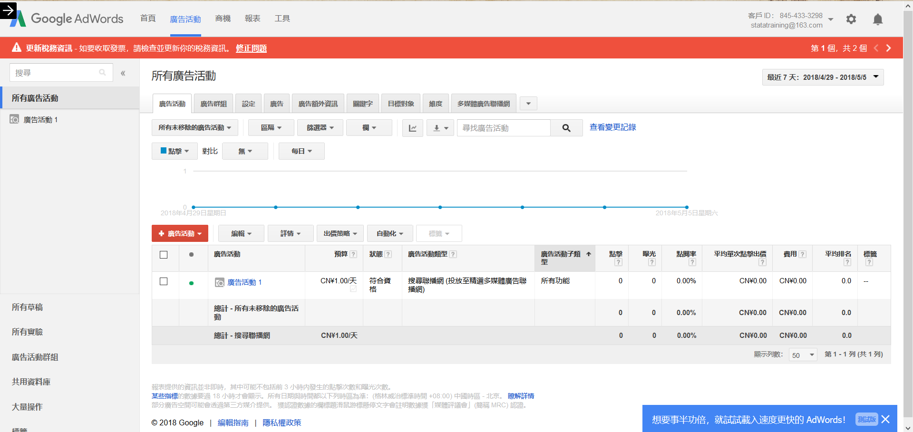
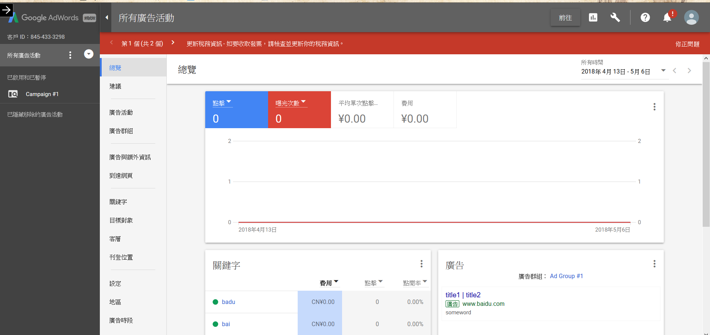
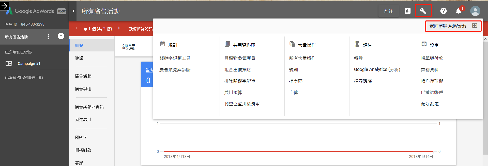
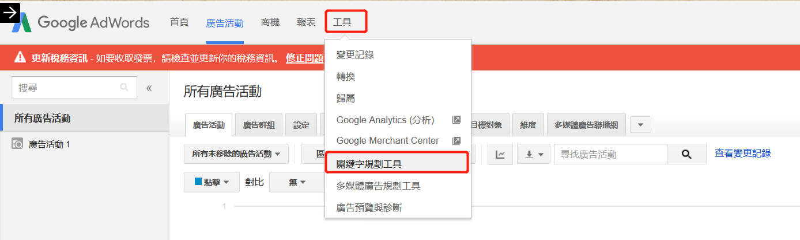
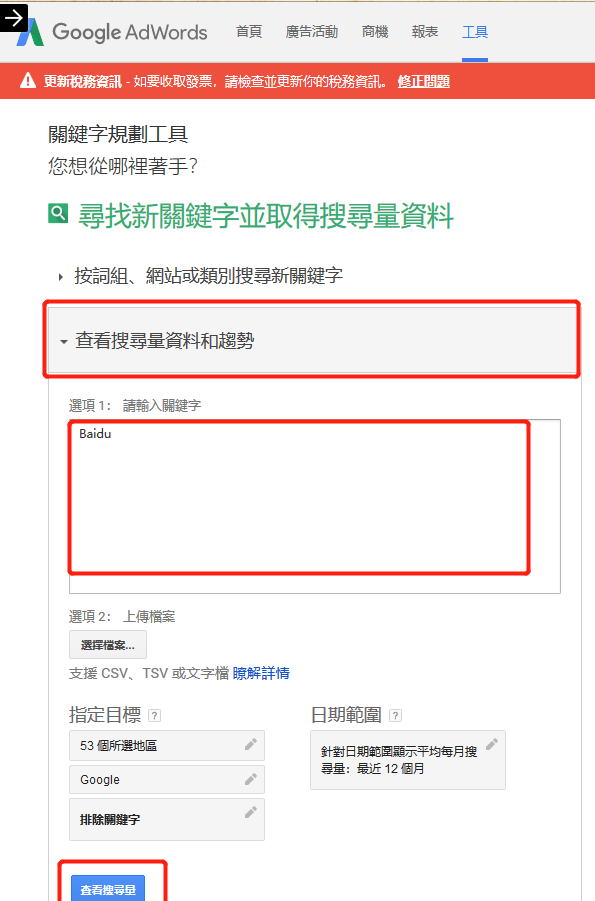
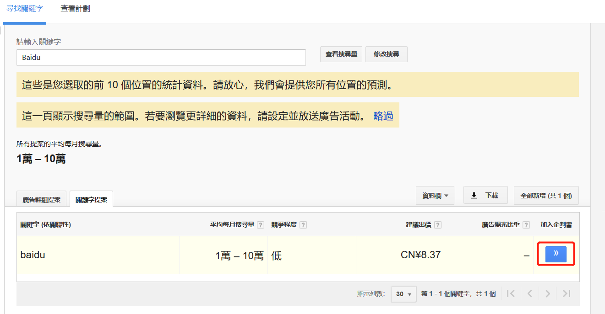
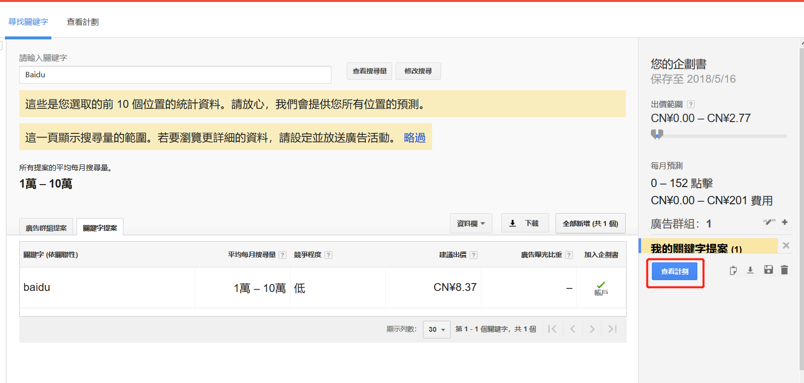
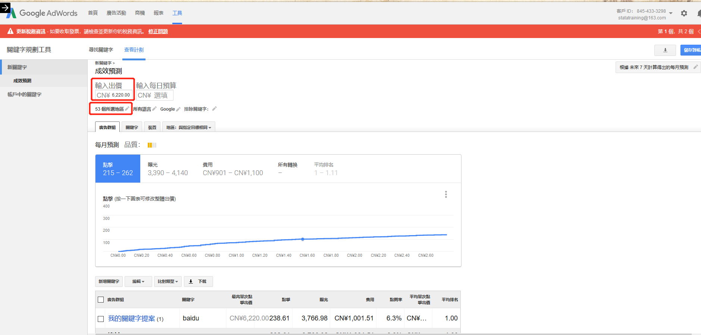

# crawler_GoogeAdword

This crawler is used to get ExposureRate of keyword in system of GoogleAdword.

## 引言

这是一个可以说很简单(单线程爬虫)却又很繁琐(人机交互判断)的爬虫，在笔者看来，它的价值也非常地高，合理地利用这一项目总结的思想，可以处理大多数类似情况下的业务需求。故而在本篇README中，笔者将尽量详细地介绍这一项目的准备以及来源始末。如果您在仔细阅读了本篇指导文档后仍然对其中的细节感到疑惑，建议您

1. 站在岸上学不会游泳，try again!
2. 请联系我，一起分享遇到的问题  
    1. E-mail: zhijunzhang_hi@163.com
    2. Wechat: renxdu
    3. QQ: 599160542

## 背景介绍

### 1.GoogleAdword

GoogleAdword 是一种通过使用Google 关键字广告或者Google遍布全球的内容联盟网络来推广网站的付费网络推广方式，即客户通过GoogleAdword购买关键词广告并投放市场。之所以我们的爬虫对这个网站感兴趣，是因为其提供的`关键词规划师`功能，能够帮助客户了解他准备投放的关键词在全球各地区有着大概多少的热度与点开率，也就意味着，我们可以借助`关键词规划师`从侧面了解一些词汇的热度，起到监控词汇热度的功能。其[官方网站](https://adwords.google.com)目前在中国大陆处于无法访问的状态，经过笔者测试，付费版[蓝灯lantern](https://getlantern.org/faq/index.html)有着良好的性能

#### 1.1 注册GoogleAdword

登录[GoogleAdword官方网站](https://adwords.google.com)，使用邮箱进行注册（大陆境内邮箱亦可），在正式进入广告系统以前，Google会要求你提供许多信息（将你视为广告付费者的信息），随意填写即可，Google不会进行人工审查。

#### 1.2 关键词规划师

在成功进入系统后的页面应如下图所示，如果不是，则您进入的是其新版本系统，请切换至老版本系统。




> 如何切换到老版本？

如果您的页面如下显示，则按如下操作返回老版本






-------

言归正传，在老版本中进行如下点击进入关键词规划师











在上图中，可以输入投放价格（最高为1000美元，即6200+人民币）以及搜索城市，在`地区：与指定目标相同`子页即可看到指定城市在该关键词下的搜索结果，包括曝光量，点击量。

### 2. 爬虫方法

由于GoogleAdowrd服务器在实际的参数递交过程中十分繁杂，故使用webdriver进行处理，具体的思路是:通过驱动webdriver打开GoogleAdword，然后不断地更新关键词参数，获取相应的数据。

### 3. 准备材料

#### 3.1 虚拟专用网络(VPN)

在这里笔者推荐付费版蓝灯([官方站点](https://getlantern.org/faq/index.html))，优势在于只要打开蓝灯后，后续使用webdriver驱动的浏览器均可访问外网。

#### 3.2 webdriver

本次爬虫的代码为Python，其中selenium([官方手册](https://pypi.org/project/selenium/))是webdriver的3.0版本，使用`pip install selenium`直接进行下载即可获得。

较之麻烦的是，所驱动的浏览器版本是一个大问题，之前笔者在进行测试开发的时候总是出错，后反复折腾后才知道是因为版本未更新至最新版，至于为什么没有使用仅仅三天前释出的最新版就会报错，这可真是又一个玄学问题了。

在这里同样给出chromedriver的[淘宝镜像](https://npm.taobao.org/mirrors/chromedriver)，以备更新。

#### 3.3 Spyder

在这里笔者推荐使用Spyder这一IDE进行脚本处理，这是因为在爬虫的过程中，有些操作(极少数的)需要人工完成，而一旦脚本运行中断，Spyder在内存中仍在存有浏览器句柄对象，可以在手工操作结束后继续驱动脚本进行处理。

## 代码解读

### 1. 初始化浏览器对象

```python

def init_chrome():
    '''初始化一个浏览器对象'''
    chromedriver = r"C:\Users\Machenike\AppData\Local\Google\Chrome\Application\chromedriver238.exe"  
    os.environ["webdriver.chrome.driver"] = chromedriver  
    options = webdriver.ChromeOptions()
    options.add_argument('--ignore-ssl-errors')
    browser = webdriver.Chrome(chrome_options = options ,executable_path = chromedriver)   
    return browser
```

1. chromedriver给出的是下载完毕的供selenium驱动的chrome浏览器路径。
2. 该函数返回的是浏览器句柄browser

### 2. 登录账户

在设置完毕Google Adword的账户后(即可以打开Google Adword系统)，该函数用于调用chrome浏览器句柄，完成从打开Adword首页到进入系统的工作，其中包括的具体动作有

输入账户名-点击进入-输入密码-点击进入

```python
def signin(email,password):
    chrome = init_chrome()
    GETurl = "http://adwords.google.com/"
    chrome.get(GETurl)
    signin = chrome.find_element_by_class_name('cta-signin')
    signin.send_keys(Keys.ENTER)
    canbelocate = True
    while canbelocate:
        try:
            EmailText = chrome.find_element_by_id('identifierId')
            canbelocate = False
        except NoSuchElementException:
            pass
    EmailText.send_keys(email)
    EmailText.send_keys(Keys.ENTER)
    canbelocate = True
    while canbelocate:
        try:
            PasswordText = chrome.find_element_by_name('password')
            PasswordText.send_keys(password)
            canbelocate = False
        except ElementNotVisibleException:
            pass
        except NoSuchElementException:
            pass
    
    EnterKey = chrome.find_element_by_id("passwordNext")
    EnterKey.send_keys(Keys.ENTER)
    print("sussess sign in ")
    return chrome

```

在上述逻辑中出现了一种`try except`结合的形式，即对try部分的代码反复执行直至有效，这是因为在使用脚本驱动的过程中，某个页面组件不能迅速被find_element捕捉到(比如刚刚点击确定键，网页不能马上返回实质内容)，这会触发`NoSuchElementException`错误，因此只有确认了该组件被找到，才进行下一步活动，在本次脚本的许多部分，我们都能看见以此为基础构造出的各种应对策略。

### 3.主函数逻辑

在`test.py`部分关于主要函数有两个，为了方便期间分别命名为func101和func103，func101的主要目的是点击更换关键词。func103的主要作用是读取该关键词下的曝光量信息。

**难点**

事实上，虽然看起来非常简单，但是其中有着很多不实际写出来就不能发现的问题，比如第一个意想不到的地方是，在GoogleAdword的页面上，关于`//*[@id=\"gwt-debug-column-IMPRESSIONS-row-%d-3\"]/div`的Xpath路径竟然有两条————是的，一个页面中有两个相同id的标签，其中第一个指向着PC端还是移动端的数据，另一个指向真正的曝光量数据，这个bug在第一次的爬虫中没有被发现，笔者只是以为前三名城市的数据经常不准而已，后来发现数据是稳定的，只是爬错了数据。

第二个意想不到的点在于，在func101完成了它的工作后，服务器会有一个长短不一的加载时间加载新数据，我们必须在func101和func103之间建立一个机制，以确定目前获得的数据是否被更新了，如果没有被更新，则继续等待至更新，如果更新了，则读取之。

第三个意想不到的地方是，脚本会不定期报出`StaleElementReferenceException`错误，目前笔者还不知道这个错误报出的真实原因，只知道它以一个较低的频率在func101和func103中不定期出现，频率低于1%，且可以通过反复执行克服。